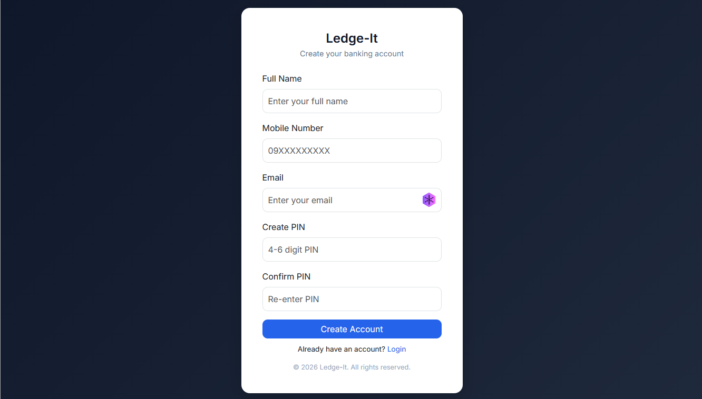
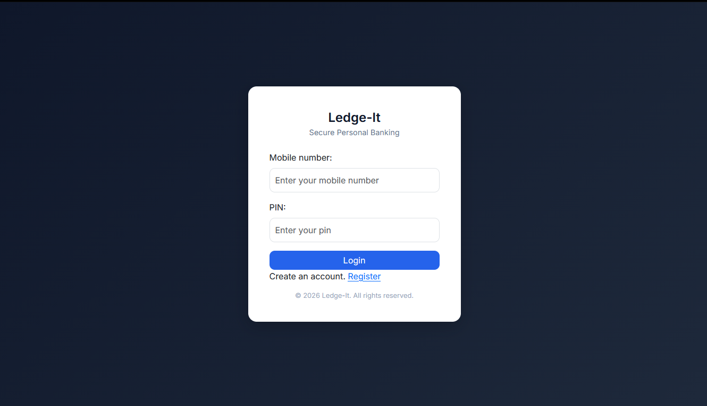
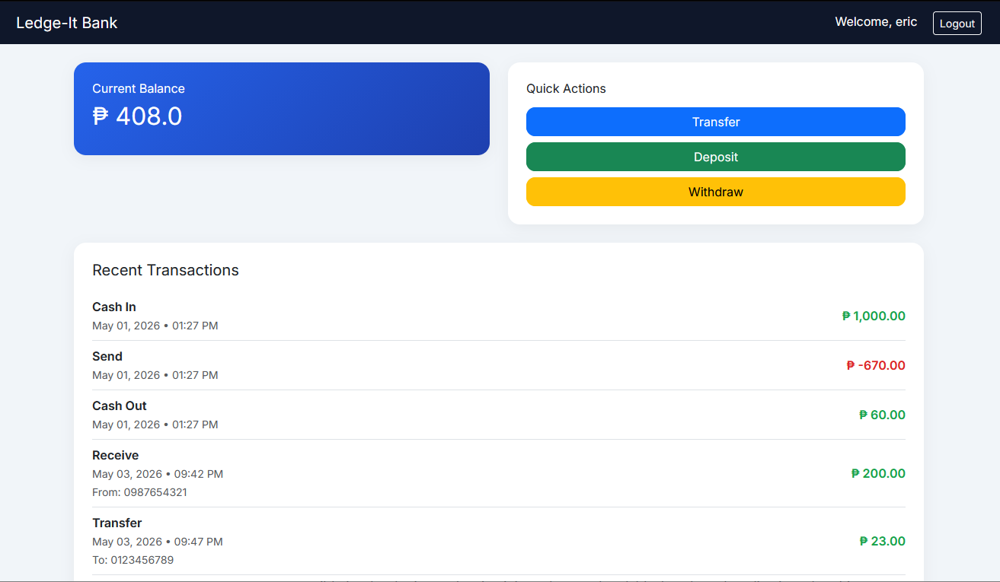

# Banking Web App

A Spring Boot web application for simple banking operations including user registration, login, balance management, deposits, withdrawals, transfers, and transaction history.

## Overview

This project is a simple online banking demo built with:
- Java 21
- Spring Boot 4
- Spring MVC
- Spring Data JPA
- Thymeleaf templates
- PostgreSQL database

It supports the following core functions:
- User signup and login
- Account creation for new users
- Dashboard with account balance and transaction history
- Deposit funds into account
- Withdraw funds from account
- Transfer money to other users
- Logout and session reset

## Features

### Authentication & User Management
- `GET /signup` — registration form page
- `POST /signup` — create a new user account
- `GET /login` — login page
- `POST /login` — authenticate user by account number and PIN
- `GET /logout` — reset current session and return to login

### Dashboard & Banking Operations
- `GET /dashboard` — display account summary and transactions
- `POST /deposit` — deposit a positive amount into current account
- `POST /withdraw` — withdraw an amount if balance is sufficient
- `POST /transfer` — transfer funds to another registered user

### Transaction Tracking
- Transaction history is shown on the dashboard
- Deposits, withdrawals, transfers, and received transfers are recorded

## Project Structure

- `src/main/java/com/pena/banking_web_app/` — application source code
- `src/main/resources/templates/` — Thymeleaf HTML templates
- `src/main/resources/application.properties` — database and Spring Boot settings
- `pom.xml` — Maven build configuration

## Prerequisites

- Java 21 SDK installed
- Maven build tool (or use bundled `mvnw` / `mvnw.cmd`)
- PostgreSQL server

## Database Setup

1. Create a PostgreSQL database named `bankdb`.
2. Configure credentials in `src/main/resources/application.properties`:

```properties
spring.datasource.url=jdbc:postgresql://localhost:5432/bankdb
spring.datasource.username=postgres
spring.datasource.password=password
```

3. Ensure the database user has privileges to create and modify tables.

> Note: The application is configured with `spring.jpa.hibernate.ddl-auto=update`, so JPA will create and update tables automatically.

## Running the Application

From the project root directory:

On Windows:
```powershell
mvnw.cmd spring-boot:run
```

On macOS/Linux:
```bash
./mvnw spring-boot:run
```

Then open your browser at:
```
http://localhost:8080/login
```

## Usage Guide

### Register a new user
1. Open `/signup`
2. Enter name, account number, email, PIN, and confirm PIN
3. Submit the form
4. After successful signup, you will be redirected to `/login`

### Login
1. Open `/login`
2. Enter your account number and PIN
3. If valid, you will be redirected to `/dashboard`

### Dashboard actions
- View current account balance
- Review transaction history
- Deposit money via the deposit form
- Withdraw money via the withdraw form
- Send money to another user via the transfer form

## Application Pages

- `login.html` — login screen
- `signup.html` — user registration
- `dashboard.html` — account summary, transaction history, and banking controls
- `balance.html` — balance page (if used by other flows)
- `profile.html` — profile page (if integrated later)
- `test.html` — test or debug page


## Notes

- The app currently stores session state in controller fields (`user`, `account`). For multi-user production usage, migrate session state to a safer method such as HTTP session or Spring Security.
- The application is designed as a demo and may require additional validation, security hardening, and error handling for production readiness.

## Suggested Improvements

- Add role-based authentication
- Improve validation on registration and transaction forms
- Add unit and integration tests for service and controller logic
- Add logging and audit history for transfers

---

For questions or updates, modify this README with details about deployment, environment variables, or live demo links.
